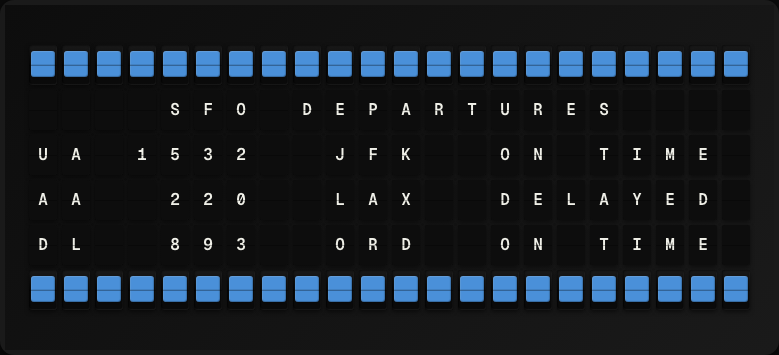

# Airport Board Plugin

Display live flight information near a configurable airport.



**→ [Setup Guide](./docs/SETUP.md)**

## Overview

The Airport Board plugin queries the OpenSky Network's public REST API for aircraft currently flying in the airspace around a given airport's coordinates. It shows the nearest tracked flight's callsign, altitude, and origin country. No API key is required for the anonymous tier (rate-limited to 400 requests/day).

## Template Variables

| Variable | Description | Example |
|---|---|---|
| `airport_board.airport` | Configured airport display name | `SFO` |
| `airport_board.flight_count` | Number of flights detected in the search area | `12` |
| `airport_board.callsign` | Callsign of the nearest tracked flight | `UAL123` |
| `airport_board.altitude_ft` | Geometric altitude of the nearest flight in feet | `8500` |
| `airport_board.origin_country` | Origin country of the nearest flight | `United States` |

## Example Templates

```
{{airport_board.airport}} FLIGHTS
Nearby: {{airport_board.flight_count}}

{{airport_board.callsign}}
Alt: {{airport_board.altitude_ft}} ft
{{airport_board.origin_country}}
```

## Configuration

| Setting | Name | Description | Required |
|---|---|---|---|
| `latitude` | Airport Latitude | Latitude of the airport (decimal degrees). | Yes |
| `longitude` | Airport Longitude | Longitude of the airport (decimal degrees). | Yes |
| `radius_deg` | Search Radius (degrees) | Search radius in degrees (≈1° = 111 km). Default 1.0. | No |
| `airport_name` | Airport Name | Display name shown on the board (e.g. SFO). | No |

## Features

- OpenSky Network live flight data
- Configurable airport coordinates and radius
- Nearest flight callsign and altitude
- Anonymous tier — no API key needed

## Author

FiestaBoard Team
